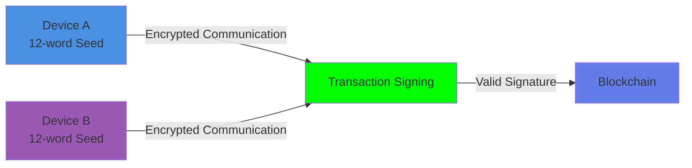
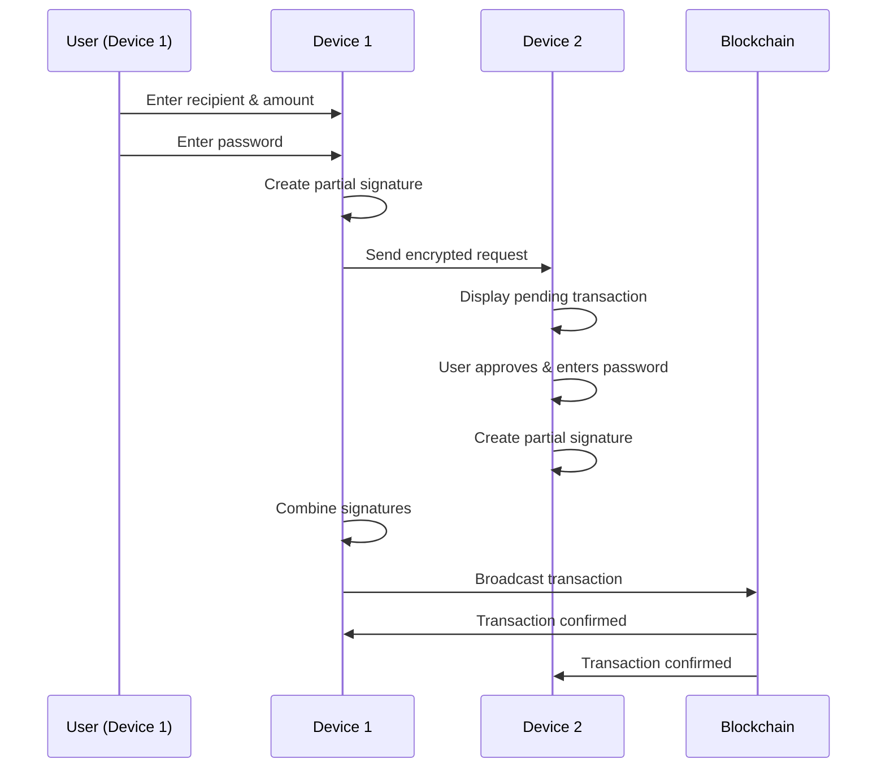

# Borays-Crypto-Wallet-App
Crypto Wallet
# BORAYS Crypto Wallet

<div align="center">


**Enhanced Security with Split Key Cryptography**

[](https://www.uow.edu.au/)
[](LICENSE)
[](https://ethereum.org/)

*A next-generation cryptocurrency wallet with dual-device security architecture*

[Features](#-key-features) • [How It Works](#-how-it-works) • [Getting Started](#-getting-started) • [Security](#-security-architecture) • [Support](#-support--contact)

</div>

---

## 📋 Table of Contents

- [Introduction](#-introduction)
- [Key Features](#-key-features)
- [Security Architecture](#-security-architecture)
- [System Requirements](#-system-requirements)
- [Getting Started](#-getting-started)
  - [Creating a Wallet](#1-creating-a-wallet)
  - [Setting Up Devices](#2-setting-up-devices)
  - [Importing a Wallet](#3-importing-a-wallet)
- [Using Borays](#-using-borays)
  - [Receiving Cryptocurrency](#receiving-cryptocurrency)
  - [Sending Cryptocurrency](#sending-cryptocurrency)
- [Wallet Features](#-wallet-features)
- [Troubleshooting](#-troubleshooting)
- [FAQ](#-frequently-asked-questions)
- [Safety Recommendations](#-safety-recommendations)
- [Support & Contact](#-support--contact)

---

## 🌟 Introduction

**Borays** is a next-generation cryptocurrency wallet designed to deliver **unmatched security** by leveraging a unique **two-device signing mechanism**. Unlike conventional wallets that store a complete private key on a single device, Borays divides the signing authority between two trusted devices—**Device A** and **Device B**—ensuring that no transaction can be executed without the explicit consent of both.

This architecture mitigates the risk of:
- 🔒 Key compromise
- 🛡️ Malware-based exploits
- 🚫 Unauthorized access

### 🎓 Academic Project

Developed as part of an academic project at the **University of Wollongong**, Borays combines cutting-edge cryptographic techniques to enable secure cryptocurrency management for users who demand higher standards of operational security.

---

## ✨ Key Features

### 🔐 Two-Party ECDSA Signing
Instead of storing the entire private key on a single device, Borays splits the key across two devices. No individual device can sign a transaction on its own, minimizing the risk of key leakage and attacks.

### 🔒 Paillier Homomorphic Encryption
Enables secure interaction between devices during transaction signing. Device A and Device B compute partial signatures over encrypted values, preserving confidentiality throughout the communication process.

### 🔑 Mnemonic-Based Recovery
- **24-word recovery phrase** generated during wallet creation
- **First 12 words** used on Device A
- **Remaining 12 words** used on Device B
- Together they reconstruct the same wallet address while maintaining dual-authentication

### 👥 Dual Device Authentication
Every transaction must be explicitly approved by **both devices** before being signed and broadcast to the blockchain. This drastically reduces risks even if one device is compromised.

### 🪙 Ethereum & ERC-20 Support
- Native support for Ethereum transactions
- Compatible with ERC-20 tokens
- Sepolia testnet support for testing

### 🚀 Future Enhancements
- Biometric authentication
- NFT management
- Smart contract interaction

---

## 🛡️ Security Architecture

Borays implements multiple layers of advanced security:



### 🔐 Security Features

| Feature | Description |
|---------|-------------|
| **Split Private Key** | No single device holds the complete private key |
| **Paillier Encryption** | Homomorphic encryption for secure device communication |
| **Dual Authentication** | Both devices must approve every transaction |
| **Password Protection** | Each device requires separate password authentication |
| **Mnemonic Security** | 24-word recovery phrase split across devices |
| **Zero Trust Model** | Even compromised device cannot authorize transactions alone |

### 🔒 What Makes Borays Secure?

#### ✅ Private Key Never Reconstructed
Your private key is split using a two-party ECDSA scheme. No single device ever holds the full key at any point.

#### ✅ Encrypted Communication
During transaction signing, partial keys and approvals are exchanged using Paillier homomorphic encryption, ensuring:
- All signatures are securely computed
- No sensitive information is leaked during communication

#### ✅ Device Isolation
Even if one device is compromised, transactions cannot be processed without the other device's approval.

#### ✅ Network Verification
Transactions are only displayed after being validated on-chain, ensuring transparency and finality.

---

## 💻 System Requirements

- **Operating System**: Android 8.0+ / iOS 12+ / Windows / macOS / Linux
- **Network**: Stable internet connection
- **Devices**: Two separate devices (smartphones, tablets, or computers)
- **Storage**: Minimum 100MB available space per device

---

## 🚀 Getting Started

### 1. Creating a Wallet

#### Step 1: Launch Borays

Open the Borays application on your first device. You'll see the home screen with two options:
- **Create New Wallet**: For first-time users
- **Import Existing Wallet**: For wallet recovery


#### Step 2: Generate Recovery Phrase

After selecting "Create Wallet," Borays generates a **24-word mnemonic phrase**. This is critical for wallet recovery.


> ⚠️ **CRITICAL SECURITY WARNING**
> - Never share your recovery phrase with anyone
> - Store it in a secure, offline location
> - We will never ask for your recovery phrase
> - If you lose your recovery phrase, you lose access to your wallet

#### Step 3: Split Recovery Phrase

The 24-word phrase is divided between two devices:

**Device 1 (Primary)**: Words 1-12


**Device 2 (Secondary)**: Words 13-24


---

### 2. Setting Up Devices

#### Device 1 Setup

1. **Verify Recovery Phrase**: Enter all 12 words in correct order
   
   

2. **Set Passwords**: Create two separate passwords:
   - **Login Password**: For daily access to Device 1
   - **Transaction Password**: For approving transactions

   

#### Device 2 Setup

1. **Verify Recovery Phrase**: Enter words 13-24 in correct order

   

2. **Set Passwords**: Create two separate passwords for Device 2
   - **Login Password**: For daily access to Device 2
   - **Transaction Password**: For approving transactions

   

3. **Complete Setup**: Click "Complete Wallet Setup"

> 💡 **Tip**: Use strong passwords combining symbols, numbers, and upper/lowercase characters.

#### Dashboard

Once setup is complete, you'll see your wallet dashboard:


**Dashboard Features**:
- 📊 Real-time token balance
- 💸 Send button
- 📥 Receive button
- ⏳ Pending transactions
- 💎 Asset list
- 🎨 NFT support (coming soon)

---

### 3. Importing a Wallet

If you need to restore an existing Borays wallet:

#### Step 1: Select Device to Import


Choose which device you're importing:
- **Device 1**: Requires words 1-12
- **Device 2**: Requires words 13-24

#### Step 2: Enter Recovery Phrase

**For Device 1**:


**For Device 2**:


#### Step 3: Set New Passwords


#### Step 4: Access Restored Wallet


> ✅ Your wallet is now restored and ready to use!

---

## 💰 Using Borays

### Receiving Cryptocurrency

#### Display Your Wallet Address

1. Navigate to the Dashboard
2. Click **"Receive"** button
3. Your wallet address and QR code will be displayed


**You can share**:
- ✅ Wallet address (read-only, safe to share)
- ✅ QR code for easy scanning
- ❌ Never share your recovery phrase or passwords

#### Testing with Sepolia Faucet

For testing purposes, use the Ethereum Sepolia faucet:

1. Visit: [https://cloud.google.com/application/web3/faucet/ethereum/sepolia](https://cloud.google.com/application/web3/faucet/ethereum/sepolia)
2. Paste your Borays wallet address
3. Submit the request
4. Wait for confirmation (usually a few seconds to minutes)


#### Confirming Receipt

Once tokens are received, your dashboard balance updates automatically:


---

### Sending Cryptocurrency

#### The Dual-Approval Process



#### Step 1: Initiate Transaction (Device 1)

1. Click **"Send"** on Device 1
2. Enter recipient's wallet address
3. Specify amount to send
4. Enter your Device 1 transaction password


#### Step 2: Transaction Created


> ⏳ The transaction is now pending approval from Device 2

#### Step 3: Approve on Device 2

Device 2 receives a notification of the pending transaction:


Click to view transaction details:


**Review carefully**:
- ✅ Sender address
- ✅ Recipient address
- ✅ Amount
- ✅ Transaction ID

Enter Device 2 transaction password and click **"Approve Transaction"**

#### Step 4: Transaction Completed


The transaction is now broadcast to the Ethereum blockchain!

#### Step 5: Verify Balance

Your updated balance appears on the dashboard:


#### Step 6: Blockchain Verification (Optional)

You can verify your transaction on Etherscan:


Visit [https://etherscan.io](https://etherscan.io) and enter your transaction hash to view:
- ✅ Transaction status
- ✅ Sender and receiver addresses
- ✅ Gas fee and usage
- ✅ Timestamp and block number

---

## 🎯 Wallet Features

### Balance Management
- Real-time balance updates from blockchain
- Multi-token support (ETH and ERC-20)
- Transaction history tracking

### Transaction Management
- Send and receive Ethereum
- Pending transaction tracking
- Transaction verification

### Security Settings
- Password management
- Device pairing status
- Secure logout

### Recovery Options
- Mnemonic-based wallet restoration
- Independent device recovery
- Secure backup reminders

---

## 🔧 Troubleshooting

| Issue | Possible Cause | Solution |
|-------|----------------|----------|
| Transaction approval stuck | Device B closed or unresponsive | Reopen app and check Pending Approvals |
| App crashes | Compatibility or storage issues | Clear cache or reinstall latest version |
| Cannot see balance | Network connectivity issue | Check internet connection and refresh |
| Wrong mnemonic error | Incorrect word order or spelling | Verify each word carefully |
| Transaction failed | Insufficient gas or balance | Ensure adequate ETH for gas fees |

---

## ❓ Frequently Asked Questions

### Q1: What happens if I lose one device?

**A**: You can restore the wallet on a new device using the appropriate 12-word mnemonic phrase for that device. You'll need to re-pair the devices after restoration.

### Q2: Can I send cryptocurrency from one device only?

**A**: No. Both devices must approve each transaction. This is a core security feature of Borays.

### Q3: What encryption does Borays use?

**A**: Borays uses:
- **ECDSA** for digital signatures
- **Paillier homomorphic encryption** for secure communication between devices

### Q4: How is my mnemonic stored?

**A**: Your mnemonic is **never stored** by the application. You must keep it safe offline. Borays only uses it during wallet creation/import.

### Q5: Can I use the same wallet on more than two devices?

**A**: No. Borays is specifically designed for a two-device architecture for optimal security.

### Q6: Is Borays open source?

**A**: Yes! This is an academic project, and the code is available for review and contribution.

### Q7: Which blockchains does Borays support?

**A**: Currently, Borays supports Ethereum and ERC-20 tokens. More blockchains may be added in future releases.

### Q8: What are the gas fees?

**A**: Gas fees are standard Ethereum network fees and are not controlled by Borays. They vary based on network congestion.

### Q9: Can I cancel a pending transaction?

**A**: Device 2 can reject a pending transaction if it hasn't been approved yet.

### Q10: Is Borays available on mobile?

**A**: Borays is designed for cross-platform use, including mobile, desktop, and tablet devices.

---

## 🛡️ Safety Recommendations

### 🔒 Critical Security Practices

1. **Mnemonic Storage**
   - ✅ Write down your 24-word phrase on paper
   - ✅ Store in a secure, offline location (safe, vault)
   - ✅ Consider metal backup plates for fire/water resistance
   - ❌ Never store digitally (photos, cloud, email)
   - ❌ Never share with anyone, including "support"

2. **Password Security**
   - ✅ Use strong, unique passwords for each device
   - ✅ Include symbols, numbers, upper/lowercase
   - ✅ Use a password manager if needed
   - ❌ Don't reuse passwords from other services

3. **Device Security**
   - ✅ Enable device PINs or biometric locks
   - ✅ Keep devices physically secure
   - ✅ Use different device types for added security
   - ✅ Update operating systems regularly

4. **Pairing Codes**
   - ❌ Never share pairing codes with anyone
   - ✅ Only pair with devices you physically control

5. **Transaction Verification**
   - ✅ Always verify recipient address before approving
   - ✅ Double-check transaction amounts
   - ✅ Be cautious of phishing attempts

6. **Regular Backups**
   - ✅ Test your recovery phrase on a clean device
   - ✅ Keep multiple secure copies in different locations
   - ✅ Regularly verify backup integrity

### ⚠️ Warning Signs of Compromise

- Unexpected transaction requests
- Unknown devices trying to pair
- Balance discrepancies
- App behaving unusually

If you suspect compromise:
1. Do not approve any pending transactions
2. Transfer funds to a new wallet immediately (from a secure device)
3. Contact support for guidance

---

## 📧 Support & Contact

This application is developed as an academic project by **Group-T** at the **University of Wollongong**.

### 🌐 Resources

- **GitHub Repository**: [https://github.com/kyathamvinay/Borays-Dual-wallet](https://github.com/kyathamvinay/Borays-Dual-wallet)
- **Documentation**: Available in this repository
- **Email Support**: support@borayswallet.com

### 🐛 Bug Reports & Feature Requests

Found a bug or have a feature suggestion? Please open an issue on our GitHub repository!

[Report Issue](https://github.com/kyathamvinay/Borays-Dual-wallet/issues)

### 🤝 Contributing

We welcome contributions from the community! Please read our contributing guidelines before submitting pull requests.

### 📜 License

This project is an academic demonstration. Please review the LICENSE file for usage terms.

---

## 🎓 Academic Context

**Project**: Dual-Device Cryptocurrency Wallet with Split-Key Architecture

**Institution**: University of Wollongong, Australia

**Team**: Group-T

**Focus Areas**:
- Applied Cryptography
- Blockchain Security
- Distributed Systems
- User Experience Design

---

## 🙏 Acknowledgments

- University of Wollongong for supporting this research
- The Ethereum Foundation for blockchain infrastructure
- The cryptography community for ECDSA and Paillier implementations
- All contributors and testers

---

<div align="center">

### 🌟 Star this repository if you find it useful! 🌟

**Borays Crypto Wallet** - *Redefining Cryptocurrency Security*

Made with ❤️ by Group-T

</div>

---

## 📊 Project Statistics

```
Lines of Code: 15,000+
Supported Tokens: Ethereum + ERC-20
Security Layers: 5
Devices Required: 2
Encryption Standards: ECDSA + Paillier
Development Status: Academic Demo
```

---

## 🗺️ Roadmap

### ✅ Completed
- [x] Two-device wallet architecture
- [x] Mnemonic-based recovery
- [x] Ethereum transaction support
- [x] Paillier encryption implementation
- [x] User-friendly interface

### 🚧 In Progress
- [ ] Biometric authentication
- [ ] Multi-language support
- [ ] Enhanced transaction history

### 🔮 Future Plans
- [ ] NFT management
- [ ] Smart contract interaction
- [ ] Multi-chain support (Bitcoin, Polygon, etc.)
- [ ] Hardware wallet integration
- [ ] Mobile app optimization
- [ ] Browser extension

---

<div align="center">

**Important Disclaimer**

*This is an academic project developed for educational purposes. While we've implemented robust security measures, users should exercise caution when handling real cryptocurrency. Always test with small amounts first.*

---

© 2024 Group-T, University of Wollongong. All Rights Reserved.

</div>
